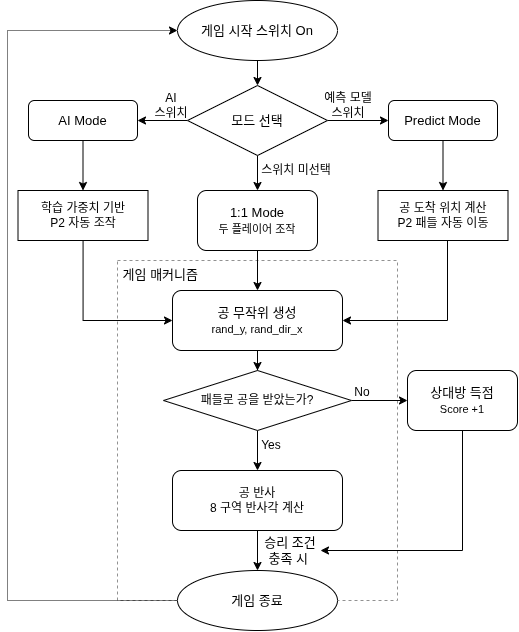

# 🎮 Pong Remaster — Basys3 RTL Project

> Basys3 FPGA에서 Verilog RTL로 구현한, DQN 기반 AI 대전 모드를 탑재한 Pong 게임

<!--

-->

---

## 1. Overview

| 항목 | 내용 |
|------|------|
| 플랫폼 | Digilent Basys3 (Artix-7 FPGA) |
| 언어 | Verilog HDL |
| 도구 | Vivado |
| 해상도 | 800×480 @ 60Hz |
| 개발 기간 | 2026.03.28 - 04.01 |
| 팀 구성 | 5인 팀 프로젝트 |

---

## 2. 주요 기능 (Key Features)

- 1:1 대전 모드 — 두 플레이어가 버튼으로 패들 직접 조작
- AI 모드 — Colab DQN 학습 가중치를 Verilog 상수로 내장, 조합 논리 기반 신경망 추론으로 P2 자동 제어
- Predict 모드 — 공의 속도 벡터로 도착 위치를 예측해 P2 패들 자동 이동, 파라미터로 난이도 조절
- 8구역 반사각 엔진 — 패들 타격 위치(rel_y)에 따라 반사 각도 결정
- VRAM 없는 실시간 렌더링 — h_cnt/v_cnt 기반 매 픽셀 조합 논리 판단
- 오리지널 Pong 사운드 재현 — v_cnt 비트 직결 구형파 출력 (아타리 방식)

---

## 3. 담당 역할 (My Role)

- Predict 모드 설계 및 구현 — 공의 속도 벡터 기반 도착 위치 예측, 데드존·반응 주기·오차 파라미터로 난이도 제어
- pong_top 통합

---

## 4. 시스템 아키텍처 및 핵심 구현

### Block Diagram

### 핵심 구현

**① 공 궤적 예측 (Predict 모드)**
공의 현재 속도 벡터(dx, dy)를 기반으로 패들 라인 도달 위치를 사전 계산해 P2 패들을 이동시킨다. `REACTION_DIV`로 반응 주기, `DEADZONE`으로 정지 허용 범위, `ERROR_RANGE`로 의도적 오차를 주입해 난이도를 파라미터로 제어한다.

**② DQN → RTL 변환 (AI 모드)**
Google Colab에서 학습한 Deep Q-Network(5→8→3)의 가중치를 정수 스케일로 변환해 Verilog 상수로 직접 내장한다. 별도의 메모리 없이 신경망 추론 전체가 클럭 없는 조합 논리 회로로 동작한다.

**③ VRAM 없는 실시간 렌더링**
h_cnt/v_cnt가 모니터 픽셀 위치를 추적하며 매 픽셀마다 조합 논리로 오브젝트 포함 여부를 즉시 판단해 색상을 출력한다. 프레임 버퍼를 사용하지 않아 BRAM 자원을 절약한다.

---

## 5. 트러블슈팅 (Troubleshooting)

| 발생 문제 | 원인 | 해결 방안 | 결과 |
|-----------|------|-----------|------|
| Predict 모드 패들이 너무 정확해 게임 성립 불가 | 예측 오차 없이 항상 최적 위치로 이동 | `ERROR_RANGE` 파라미터로 의도적 오차 주입 | 난이도 조절 가능한 자연스러운 대전 구현 |
| 공 고속 구간에서 패들 반응 뒤처짐 | `REACTION_DIV` 고정값으로 반응 주기 부족 | 속도 단계별 반응 주기 동적 조정 | 고속 구간에서도 안정적 추적 |

---

## 6. 디렉토리 구조 (Directory Structure)

| 파일 | 역할 |
|------|------|
| `codes.v` | 최상위 모듈 — 클럭 분주, VGA, 게임 물리, 렌더링 통합 |
| `ai.v` | DQN 추론 (5→8→3, 조합 논리) |
| `Pre.v` | 공 궤적 예측 기반 자동 패들 제어 |
| `sound_.v` | 사운드 서브 모듈 |
| `sound.v` | 이벤트별 구형파 사운드 출력 |
